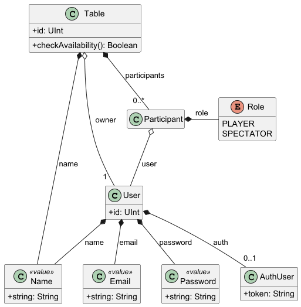
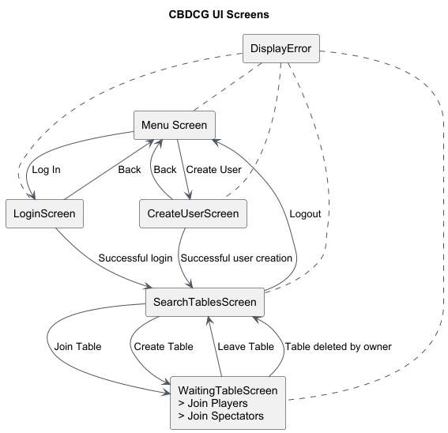

# Apresentação de Progresso - CBDCG

## 1. Titulo do projeto, grupo e orientador

- **Projeto:** `Jogo de Exploração de uma Masmorra à base de Cartas`
- **Grupo:** `15`
- **Elementos:** `Gustavo Antunes [50485] | André Brito [50487]`
- **Orientador(es):** `Paulo Pereira`

---

## 2. O que é o projeto

### 2.1 Introdução

O **CBDCG** é uma aplicação **Kotlin Multiplatform** para suportar uma experiência digital de um jogo de cartas por turnos. A solução combina um cliente em **Compose Multiplatform** com um servidor **Ktor**, partilhando modelos de domínio e contratos de comunicação entre componentes.

O objetivo do projeto é oferecer uma base digital para uma experiência multiplayer em que os jogadores:

- constroem e expandem progressivamente o tabuleiro;
- controlam personagens com atributos e habilidades distintas;
- se movimentam pelo mapa e interagem com o estado do jogo;
- defrontam inimigos e outros jogadores em batalhas simples e intuitivas;
- recolhem os itens necessários para ganharem o jogo.

### 2.2 Motivação

Este projeto surge da necessidade de transportar para formato digital uma experiência de jogo que mistura um jogo de tabuleiro e um jogo de cartas, proporcionando:

- uma componente estratégica da construção do tabuleiro de jogo;
- a gestão de personagens e itens;
- uma interação entre jogadores, tanto cooperativamente como competitivamente;

### 2.3 Enquadramento

O projeto insere-se no contexto de:

- jogos digitais turn-based;
- aplicações multiplayer cliente-servidor;
- desenvolvimento multiplataforma com partilha de lógica;
- interfaces reativas para jogos e sistemas interativos.

Do ponto de vista técnico, o projeto combina uma série de aspetos, como:

- frontend multiplataforma;
- backend responsável por autenticação, 'lobbies' e sincronização;
- comunicação em tempo real para refletir alterações no estado das salas.

### 2.4 Finalidade

A finalidade do projeto é disponibilizar uma plataforma jogável que suporte:

- autenticação de utilizadores;
- criação e gestão de mesas de jogo;
- entrada de jogadores e espetadores;
- execução completa do jogo.

### 2.5 Visão geral da solução

A arquitetura atual está organizada em tres módulos principais:

- `composeApp/`: clientes Compose Multiplatform;
- `server/`: backend Ktor com API e gestão de eventos por WebSocket;
- `shared/`: modelos de domínio, DTOs, e lógica partilhada.

Documentação e diagramas de apoio encontram-se em `Docs/`.

---

## 3. O que já está feito

### 3.1 Requisitos funcionais já suportados

- criação e autenticação de um utilizador;
- listagem de mesas de jogo;
- criação de uma mesa de jogo;
- entrada e saída de uma mesa de jogo;
- alteração de papel entre jogador e espetador;
- observação em tempo real do estado das mesas de jogo;
- observação em tempo real do estado da mesa de jogo em que o utilizador está a participar.
- navegação entre o ecrã inicial, autenticação, e o ecrã de procura de mesas de jogo.

### 3.2 Histórias de utilização

- **Como utilizador**, quero criar uma conta para aceder às funcionalidades principais na aplicação.
- **Como utilizador**, quero autenticar-me para aceder às funcionalidades principais na aplicação.
- **Como utilizador autenticado**, quero criar uma mesa para iniciar uma sessão de jogo com outros participantes.
- **Como utilizador autenticado**, quero entrar numa mesa para acompanhar ou participar numa partida.
- **Como dono da mesa**, quero gerir o estado da sala de espera antes do início do jogo.
- **Como cliente**, quero receber atualizações em tempo real quando a mesa ou a lista de mesas muda.

### 3.3 Diagramas de blocos

- **Diagrama de Domínio:** 
- **Diagrama de navegacao/UI:** 

### 3.4 Modelo de dados

O modelo de domínio inclui as entidades:

- **User**
- **AuthUser**
- **Table**
- **Participant**
- **Role** (`PLAYER`, `SPECTATOR`)
- value objects como **Name**, **Email** e **Password**

Relações principais:

- um `User` pode ter uma única autenticação associada;
- uma `Table` tem um dono e vários participantes;
- um `Participant` associa um utilizador a um papel dentro da mesa.

### 3.5 Tecnologias

- **Kotlin**
- **Kotlin Multiplatform**
- **Compose Multiplatform**
- **Ktor**
- **WebSockets** para propagação de eventos/atualizacoes
- arquitetura **client-server**

### 3.6 Aspetos tecnicos relevantes

- separação entre cliente, servidor, e lógica/modelos partilhados;
- suporte a atualizações em tempo real via WebSockets;
- existência de serviços e repositórios no backend;
- coexistência de repositórios em memória, e persistência em base de dados;
- cobertura de testes em componentes de domínio, serviços, repositórios, e API.

### 3.7 Evidencias adicionais de progresso

- estrutura modular organizada;
- documentação técnica inicial;
- diagramas PlantUML;
- implementação de endpoints e WebSockets no servidor;
- existência de testes automatizados no backend.

---

## 4. O que falta fazer e como vai ser feito

Itens que ainda precisam de desenvolvimento ou aprofundamento:

- implementação completa da lógica principal do jogo;
- fases detalhadas do turno dentro da experiência digital;
- sistema de combate;
- gestão de pecas/tabuleiro e movimentação em jogo;
- sistema de itens e condições de vitória;
- integração completa entre a UI e o jogo final;
- refinamento de UI;

### 4.1 Planeamento

| Fase    | Objetivo                                                        |
|---------|-----------------------------------------------------------------|
| Fase 1  | Decidir as regras e modelo do jogo                              |
| Fase 2  | Implementar a lógica de turnos e de construção no tabuleiro     |
| Fase 3  | Criar os ecrãs da UI para o Jogo e integrar ao modelo existente |
| Fase 4  | Implementar a lógica básica dos personagens do jogo             |
| Fase 5  | Implementar a lógica de utilização de itens                     |
| Fase 6  | Integrar os Personagens e Itens no ecrã de jogo na UI           |
| Fase 7  | Implementar a lógica de missões e as condições de vitória       |
| Fase 8  | Implementar a lógica de batalhas e eventos especiais            |
| Fase 9  | Criar os ecrãs da UI para as batalhas, itens, e eventos         |
| Fase 10 | Garantir que a sincronização entre jogadores é estável          |
| Fase 11 | Testes automáticos, correção de erros, e testes de desempenho   |

---
